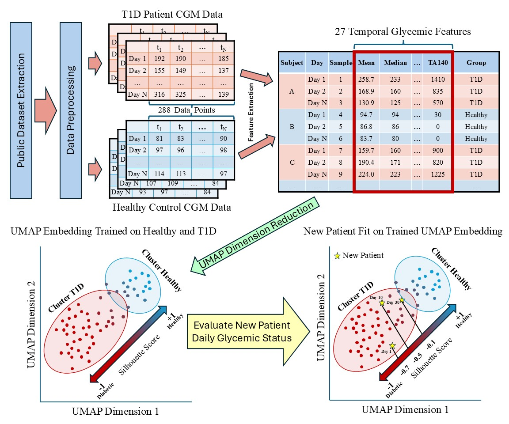

# **Riemannian Manifold-based Geometric Clustering of Continuous Glucose Monitoring Data**

This repository contains the code and data for the study titled **"Riemannian Manifold-based Geometric Clustering of Continuous Glucose Monitoring to Improve Personalized Diabetes Management"**. The project applies Riemannian manifold-based geometric clustering, to better understand glycemic control in individuals with Type 1 Diabetes (T1D) and healthy controls using Continuous Glucose Monitoring (CGM) data. The approach aims to enhance personalized diabetes management. The repository includes code for daily segmentation, glycemic feature extraction, UMAP projection, and silhouette score calculation.



---

### **Key Highlights**
- **Glycemic Feature Extraction**: Includes an easy-to-use function to compute 29 key glycemic features from CGM data.
- **UMAP Clustering**: Utilizes UMAP for effective visualization and separation of glycemic profiles.
- **Silhouette Score Analysis**: Quantifies the differences between T1D and HC clusters using Silhouette Scores.
- **Personalized Care**: Provides interpretable metrics to support more personalized diabetes management.

---

## **Public CGM Datasets**

If you're looking for publicly available Continuous Glucose Monitoring (CGM) datasets, you can find a curated list on the following GitHub repository:

[Awesome-CGM Wiki - Public Datasets](https://github.com/IrinaStatsLab/Awesome-CGM/wiki)

This resource offers a wide range of publicly accessible CGM datasets that can be used for research and analysis.

---

## **Installation**

Follow these steps to get started:

1. Clone the repository:
    ```bash
    $ git clone https://github.com/username/cgm_clustering.git
    $ cd cgm_clustering
    ```

2. Install the required dependencies:
    ```bash
    $ pip install -r requirements.txt
    ```

---

# **Usage**
**Before You Start**

Please ensure that your CSV data is formatted with the following three columns before running the scripts:

- **id**: Unique identifier for each individual or session.
- **gl**: Glucose level.
- **time**: Timestamp of the glucose measurement.

The data should be **sorted by time** and **grouped by id** for accurate processing and analysis.

The repository includes the following scripts for processing and analyzing CGM data:

- **`CGM_TAML.py`**: Handles data preprocessing, cleaning, and temporal segmentation of CGM data.
- **`cgmquantify_stuart.py`**: Extracts glycemic variability features and computes metrics for analysis.
- **`calculate_scores.py`**: Calculates Silhouette Score and Dunn Index
- **`Sample Dataset Creation.ipynb`**: Demonstrates the creation of datasets for training and validation
- **`UMAP plot and SS demo.ipynb`**: Demonstrates the projection of UMAP and the calculation of point-wise Silhouette Score


### **To Run the Code**
Simply execute any of the Python scripts or open the Jupyter notebook in your environment for experimentation.

---

## **How to Cite**

If you find this repository helpful in your research, please cite the manuscript as follows:

> **Song J., McNeany J., Wang Y., Daley T., Stecenko A., Kamaleswaran R.**, *"Riemannian Manifold-based Geometric Clustering of Continuous Glucose Monitoring to Improve Personalized Diabetes Management,"* **Computers in Biology and Medicine**, vol. 183, 2024, pp. 109255.  
> [doi:10.1016/j.compbiomed.2024.109255](https://doi.org/10.1016/j.compbiomed.2024.109255)

---

## **Contributing**

We welcome contributions! Please submit a pull request if you'd like to improve the code, add features, or fix bugs. For questions, suggestions, or feedback, feel free to reach out to Jiafeng via email: [sjfsjf2010@gmail.com](mailto:sjfsjf2010@gmail.com).

---


